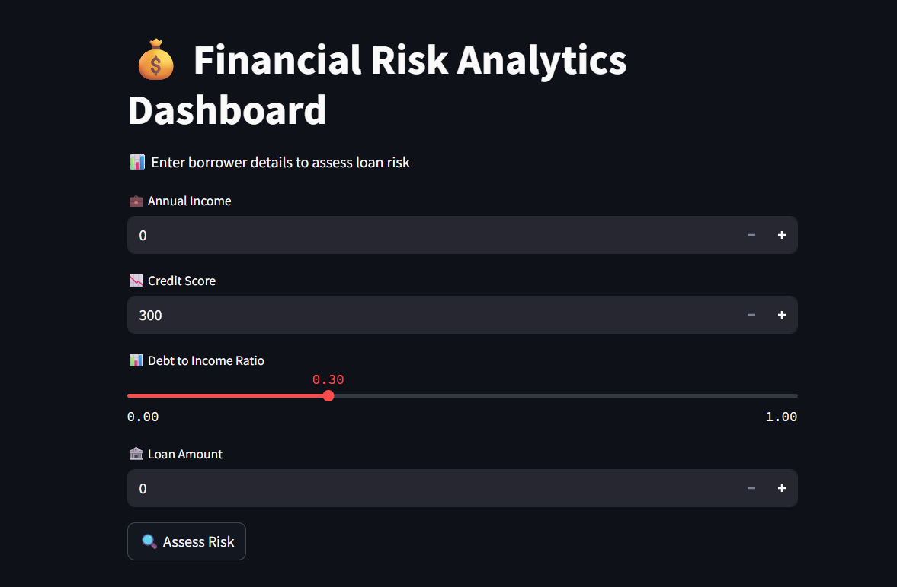

# 💰 Financial Risk Analytics Dashboard

## 📌 Project Overview
This project is a **Financial Risk Prediction System** that analyzes borrower data and predicts loan repayment risk using Machine Learning and provides an interactive dashboard for real-time risk assessment.

Built as a portfolio project for **Data Analytics / Risk Analytics roles**.

---

## 🧠 Problem Statement
Financial institutions need to evaluate whether a borrower is likely to repay a loan.  
This project builds a system to:
- Analyze borrower financial data
- Predict loan repayment behavior
- Classify risk levels (Low / Medium / High)
- Provide an interactive decision dashboard

---

## 📊 Dataset
The dataset includes borrower financial attributes such as:
- Income 💼  
- Credit Score 📉  
- Debt-to-Income Ratio 📊  
- Loan Amount 🏦  
- Employment & Demographics  

Target variable: `loan_paid_back`

---

## ⚙️ Tech Stack
- Python 🐍  
- Pandas  
- Scikit-learn 🤖  
- Matplotlib 📊  
- Streamlit 🚀  

---

## 🔍 Exploratory Data Analysis (EDA)
Performed:
- Data cleaning
- Missing value check
- Distribution analysis
- Risk factor relationships

Key insights:
- Lower credit scores increase default risk
- High debt-to-income ratio strongly correlates with loan default
- Income level influences repayment ability

---

## 🤖 Machine Learning Model
- Algorithm: Logistic Regression
- Accuracy: **88%**
- Evaluation: Precision, Recall, F1-score

The model predicts whether a borrower will repay a loan or default.

---

## 📊 Dashboard Features
- Input borrower financial details
- Real-time risk score calculation
- Risk classification (Low / Medium / High)
- Visual charts for financial profile
- Recommendation system for loan decision

## 📷 Dashboard Preview

Below is the interactive financial risk analytics dashboard built using Streamlit:



---

## 🚀 How to Run Project

```bash
git clone https://github.com/Loshna-data/financial-risk-analytics
cd financial-risk-analytics
pip install -r requirements.txt
streamlit run app/app.py

## 🚀 Live Demo

👉 Try the interactive dashboard here:  
[Click to Open Dashboard](PASTE_YOUR_LINK_HERE)